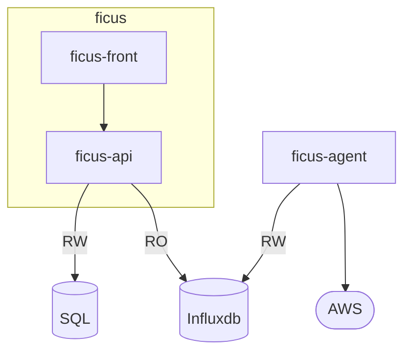

# Ficus

*Work in progress*  

### Project Architecture

* **ficus** contains both the frontend and the backend of the website:  
  * **ficus-api**: REST API built in *AdonisJS* with *Typescript*
    * *it uses a SQL database for user data*
    * *it reads resources data from an Influxdb time series database*
  * **ficus-front**: Frontend using *React* with *Typescript*
* **ficus-agent** is a *Rust* project that has to be run regularly to fetch resources usage data from cloud providers
  * *it stores that data into a Influxdb time series database*
